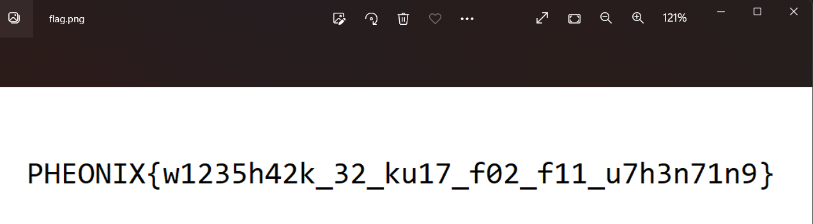

# Kabel Hai

bady shark dodododododo baby shark dodododod bagy wget flag.png.

## Læringsmål

 * Lære grunnleggende wireshark
 * Forstå at det ikke er noe magi med at filer sendes over internett

## Løsning

1. Åpne filen i wireshark
2. Trykk på fil
3. Trykk på "Export Object"
4. Trykk på "http"
5. Trykk på "preview"

