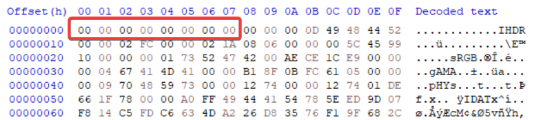

# Hvordan løse oppgaven

1. Når man forsøker å åpne oppgaven, så får man en feil melding.
2. Hvis man ser på fil navnet, så ser man at "MAGIC_png", nøkkel ordet her er png.
3. Hvis man åpner MAGIC_png i en hex editor, også ser man på de første hex, så ser man at det er bare masse "00".
4. Hvis man endrer disse til å være de magiske bytene til en PNG fil, lagre, også forsøke å åpne filen, så vil du se at flagget er åpner som et bilde.
5. Flagget er i bildet.

## flag

`PHOENIX{m461c_by735_h4r_my3_06_51}`
